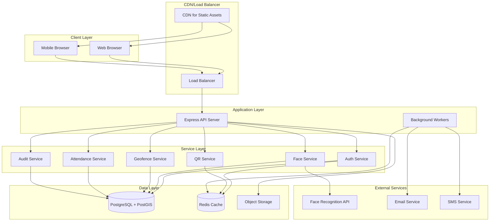
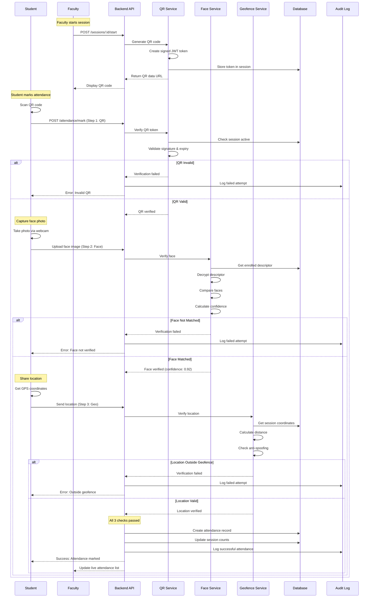
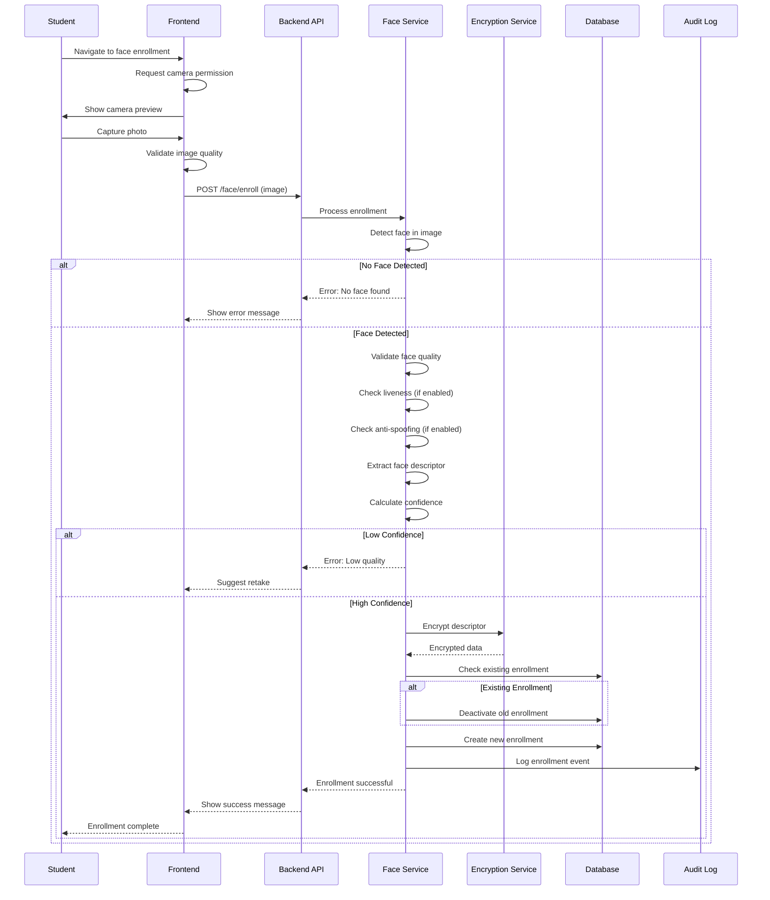
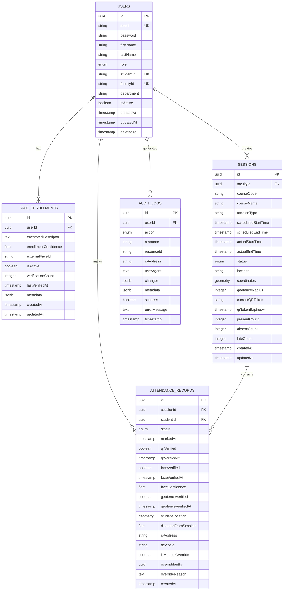

# Smart Attendance System - Complete Software Specification

**Version:** 1.0  
**Date:** April 12, 2026  
**Status:** Source of Truth for Implementation

---

## Table of Contents

1. [Product Requirements Document](#1-product-requirements-document)
2. [User Stories by Role](#2-user-stories-by-role)
3. [Functional Requirements](#3-functional-requirements)
4. [Non-Functional Requirements](#4-non-functional-requirements)
5. [Security Requirements](#5-security-requirements)
6. [AI/Face Verification Requirements](#6-aiface-verification-requirements)
7. [Geofencing Requirements](#7-geofencing-requirements)
8. [QR Session Lifecycle Requirements](#8-qr-session-lifecycle-requirements)
9. [Deployment Requirements](#9-deployment-requirements)
10. [Risks and Mitigations](#10-risks-and-mitigations)
11. [Acceptance Criteria](#11-acceptance-criteria)
12. [Architecture Diagrams](#12-architecture-diagrams)
13. [Technical Specifications](#13-technical-specifications)

---

## 1. Product Requirements Document

### 1.1 Executive Summary

The Smart Attendance System is a production-grade SaaS platform designed for universities to automate and secure attendance tracking through multi-factor verification. The system combines three verification methods—Dynamic QR codes, Face Recognition, and Geo-fencing—to ensure accurate, fraud-resistant attendance marking.

### 1.2 Problem Statement

Traditional attendance systems suffer from:
- **Proxy attendance**: Students marking attendance for absent peers
- **Manual errors**: Faculty spending valuable time on roll calls
- **Lack of real-time data**: Delayed attendance reports
- **No audit trail**: Difficulty tracking attendance disputes
- **Parent visibility gaps**: Parents unaware of student attendance patterns

### 1.3 Solution Overview

A multi-factor attendance verification system that:
- Requires ALL THREE checks to pass: QR scan + Face verification + Location check
- Provides real-time attendance tracking for faculty
- Offers comprehensive analytics for administrators
- Enables parent monitoring of student attendance
- Maintains complete audit trails for compliance

### 1.4 Target Users

| Role | Count (Typical University) | Primary Use Cases |
|------|---------------------------|-------------------|
| Students | 5,000 - 50,000 | Mark attendance, view history |
| Faculty | 200 - 2,000 | Create sessions, monitor attendance |
| Administrators | 10 - 100 | Analytics, system management |
| Parents | 5,000 - 50,000 | Monitor student attendance |

### 1.5 Key Features

#### 1.5.1 Core Attendance Flow
1. Faculty creates session with location coordinates
2. Faculty starts session and generates dynamic QR code
3. Student scans QR code (Step 1/3)
4. Student captures face photo for verification (Step 2/3)
5. System verifies location within geofence (Step 3/3)
6. If ALL checks pass → Attendance marked
7. If ANY check fails → Attendance rejected with reason

#### 1.5.2 Role-Specific Features

**Students:**
- One-time face enrollment
- Multi-step attendance marking
- Attendance history with filters
- Real-time verification feedback

**Faculty:**
- Session creation with geofence setup
- Dynamic QR code generation
- Live attendance monitoring
- Manual attendance override
- Session analytics

**Administrators:**
- System-wide analytics dashboard
- User management
- Audit log access
- Manual override approval
- Report generation

**Parents:**
- Linked student attendance view
- Absence alerts
- Attendance percentage tracking
- Historical reports

### 1.6 Success Metrics

| Metric | Target | Measurement |
|--------|--------|-------------|
| Attendance marking time | < 30 seconds | Average time from QR scan to confirmation |
| System uptime | 99.9% | Monthly availability |
| False rejection rate | < 2% | Valid students rejected due to system error |
| Fraud detection rate | > 95% | Proxy attendance attempts blocked |
| User satisfaction | > 4.5/5 | Quarterly surveys |
| Faculty time saved | > 80% | vs. manual roll call |

### 1.7 Out of Scope (v1.0)

- Biometric alternatives (fingerprint, iris scan)
- Mobile native applications (web-first approach)
- Integration with external LMS systems
- Automated timetable synchronization
- Multi-language support
- Offline attendance marking

---

## 2. User Stories by Role

### 2.1 Student User Stories

#### US-S01: Face Enrollment
**As a** student  
**I want to** enroll my face biometric data  
**So that** I can use face verification for attendance

**Acceptance Criteria:**
- Student can access face enrollment from dashboard
- System captures clear face photo via webcam
- System validates face quality before enrollment
- System encrypts and stores face descriptor
- Student receives confirmation of successful enrollment
- Student can re-enroll to update face data

**Priority:** P0 (Critical)

#### US-S02: Mark Attendance
**As a** student  
**I want to** mark my attendance using QR + Face + Location  
**So that** my presence is recorded accurately

**Acceptance Criteria:**
- Student can scan QR code displayed by faculty
- System validates QR token is current and not expired
- Student can capture face photo for verification
- System compares face with enrolled template
- System checks student location against session geofence
- ALL three checks must pass for attendance to be marked
- Student receives immediate feedback on success/failure
- Failed attempts are logged with specific reason

**Priority:** P0 (Critical)

#### US-S03: View Attendance History
**As a** student  
**I want to** view my attendance history  
**So that** I can track my attendance percentage

**Acceptance Criteria:**
- Student can view list of all attended sessions
- Student can filter by date range
- Student can filter by course
- Student can see attendance status (present, late, absent)
- Student can see attendance percentage per course
- Student can export attendance report

**Priority:** P1 (High)

#### US-S04: Receive Attendance Alerts
**As a** student  
**I want to** receive alerts when my attendance falls below threshold  
**So that** I can take corrective action

**Acceptance Criteria:**
- Student receives alert when attendance < 75%
- Alert shows current percentage and required classes
- Alert is visible on dashboard
- Student can acknowledge alert

**Priority:** P2 (Medium)

### 2.2 Faculty User Stories

#### US-F01: Create Session
**As a** faculty member  
**I want to** create a class session with location details  
**So that** students can mark attendance

**Acceptance Criteria:**
- Faculty can create session with course details
- Faculty can set session date, time, and duration
- Faculty can set location name and coordinates
- Faculty can set geofence radius (default 100m)
- Faculty can set expected student count
- System validates all required fields
- Session is saved with "scheduled" status

**Priority:** P0 (Critical)

#### US-F02: Start Session and Generate QR
**As a** faculty member  
**I want to** start a session and generate a QR code  
**So that** students can begin marking attendance

**Acceptance Criteria:**
- Faculty can start a scheduled session
- System generates signed QR code with 5-minute expiry
- QR code is displayed prominently on screen
- QR code includes session ID and timestamp
- Faculty can refresh QR code before expiry
- System updates session status to "active"

**Priority:** P0 (Critical)

#### US-F03: Monitor Live Attendance
**As a** faculty member  
**I want to** see real-time attendance updates  
**So that** I can track who has marked attendance

**Acceptance Criteria:**
- Faculty sees live count of present/late/absent students
- Faculty sees list of students who marked attendance
- List updates in real-time as students mark attendance
- Faculty can see timestamp of each attendance mark
- Faculty can see verification details (face confidence, distance)

**Priority:** P1 (High)

#### US-F04: Manual Attendance Override
**As a** faculty member  
**I want to** manually mark or override attendance  
**So that** I can handle technical issues or special cases

**Acceptance Criteria:**
- Faculty can manually mark student as present/absent/late
- Faculty must provide reason for manual override
- Override is flagged in system
- Override is logged in audit trail
- Admin can review all overrides

**Priority:** P1 (High)

#### US-F05: View Session Analytics
**As a** faculty member  
**I want to** view attendance analytics for my sessions  
**So that** I can identify attendance patterns

**Acceptance Criteria:**
- Faculty can view attendance percentage per session
- Faculty can see trend over time
- Faculty can identify students with low attendance
- Faculty can export attendance reports
- Faculty can filter by date range

**Priority:** P2 (Medium)

### 2.3 Administrator User Stories

#### US-A01: System Dashboard
**As an** administrator  
**I want to** view system-wide analytics  
**So that** I can monitor system health and usage

**Acceptance Criteria:**
- Admin sees total users by role
- Admin sees active sessions count
- Admin sees average attendance percentage
- Admin sees system uptime and performance metrics
- Admin sees recent failed verification attempts
- Dashboard updates in real-time

**Priority:** P1 (High)

#### US-A02: User Management
**As an** administrator  
**I want to** manage user accounts  
**So that** I can control system access

**Acceptance Criteria:**
- Admin can view all users
- Admin can activate/deactivate users
- Admin can reset user passwords
- Admin can change user roles
- Admin can view user activity logs
- All changes are logged in audit trail

**Priority:** P1 (High)

#### US-A03: Audit Log Access
**As an** administrator  
**I want to** access complete audit logs  
**So that** I can investigate issues and ensure compliance

**Acceptance Criteria:**
- Admin can view all audit logs
- Admin can filter by user, action, date range
- Admin can see failed login attempts
- Admin can see all manual overrides
- Admin can export audit logs
- Logs include IP address and device info

**Priority:** P1 (High)

#### US-A04: Manual Override Review
**As an** administrator  
**I want to** review all manual attendance overrides  
**So that** I can ensure policy compliance

**Acceptance Criteria:**
- Admin sees list of all manual overrides
- Admin can filter by faculty, date, reason
- Admin can approve or reject overrides
- Admin can add notes to overrides
- Students and faculty are notified of decisions

**Priority:** P2 (Medium)

### 2.4 Parent User Stories

#### US-P01: View Student Attendance
**As a** parent  
**I want to** view my child's attendance  
**So that** I can monitor their academic engagement

**Acceptance Criteria:**
- Parent can link to student account
- Parent sees student's attendance percentage
- Parent sees list of attended/missed sessions
- Parent sees attendance by course
- Parent can view historical data

**Priority:** P2 (Medium)

#### US-P02: Receive Absence Alerts
**As a** parent  
**I want to** receive alerts when my child is absent  
**So that** I can take timely action

**Acceptance Criteria:**
- Parent receives alert for each absence
- Alert includes session details
- Alert is sent via email/SMS
- Parent can configure alert preferences
- Parent can acknowledge alerts

**Priority:** P2 (Medium)

---

## 3. Functional Requirements

### 3.1 Authentication & Authorization

#### FR-AUTH-001: User Registration
- System SHALL allow users to register with email and password
- System SHALL require password minimum 8 characters
- System SHALL validate email format
- System SHALL send verification email
- System SHALL support role selection during registration
- System SHALL validate role-specific fields (studentId, facultyId)

#### FR-AUTH-002: User Login
- System SHALL authenticate users with email and password
- System SHALL generate JWT access token (15-minute expiry)
- System SHALL generate JWT refresh token (7-day expiry)
- System SHALL log all login attempts
- System SHALL track device and IP information
- System SHALL rate-limit login attempts (5 per 15 minutes)

#### FR-AUTH-003: Role-Based Access Control
- System SHALL enforce role-based permissions on all endpoints
- System SHALL restrict student features to student role
- System SHALL restrict faculty features to faculty role
- System SHALL restrict admin features to admin role
- System SHALL allow parent access to linked student data only

#### FR-AUTH-004: Session Management
- System SHALL maintain user sessions with JWT tokens
- System SHALL refresh access tokens automatically
- System SHALL invalidate tokens on logout
- System SHALL expire inactive sessions after 7 days

### 3.2 Face Recognition Module

#### FR-FACE-001: Face Enrollment
- System SHALL capture face image via webcam
- System SHALL validate face image quality
- System SHALL extract face descriptor/template
- System SHALL encrypt face descriptor with AES-256
- System SHALL store encrypted descriptor in database
- System SHALL NOT store raw face images permanently
- System SHALL allow re-enrollment to update face data
- System SHALL deactivate old enrollment when new one is created

#### FR-FACE-002: Face Verification
- System SHALL capture face image during attendance marking
- System SHALL decrypt stored face descriptor
- System SHALL compare captured face with enrolled template
- System SHALL calculate confidence score (0.0 to 1.0)
- System SHALL require confidence >= configured threshold (default 0.85)
- System SHALL perform liveness detection if enabled
- System SHALL perform anti-spoofing checks if enabled
- System SHALL log verification attempts with confidence scores

#### FR-FACE-003: Face Service Abstraction
- System SHALL support pluggable face recognition providers
- System SHALL support mock provider for development
- System SHALL support AWS Rekognition integration
- System SHALL support Azure Face API integration
- System SHALL support custom provider implementations
- System SHALL configure provider via environment variables

#### FR-FACE-004: Biometric Data Protection
- System SHALL encrypt all face descriptors at rest
- System SHALL use encryption key from environment
- System SHALL delete temporary face images after processing
- System SHALL NOT expose raw biometric data via API
- System SHALL log all biometric data access

### 3.3 QR Code Module

#### FR-QR-001: QR Code Generation
- System SHALL generate QR code when session starts
- System SHALL sign QR payload with JWT
- System SHALL include session ID in QR payload
- System SHALL include faculty ID in QR payload
- System SHALL include timestamp in QR payload
- System SHALL include unique nonce for replay protection
- System SHALL set QR expiry to configured minutes (default 5)
- System SHALL encode QR as data URL for display

#### FR-QR-002: QR Code Validation
- System SHALL verify JWT signature on QR token
- System SHALL check QR token expiry
- System SHALL validate session exists and is active
- System SHALL verify QR token matches current session token
- System SHALL check nonce for replay attacks
- System SHALL reject expired or invalid tokens
- System SHALL log all QR validation attempts

#### FR-QR-003: QR Code Refresh
- System SHALL allow faculty to refresh QR code
- System SHALL invalidate previous QR token
- System SHALL generate new QR with new nonce
- System SHALL update session with new token
- System SHALL log QR refresh events

### 3.4 Geofencing Module

#### FR-GEO-001: Location Verification
- System SHALL capture student location coordinates
- System SHALL validate coordinate format and ranges
- System SHALL calculate distance from session location
- System SHALL use PostGIS for spatial calculations
- System SHALL compare distance against session geofence radius
- System SHALL mark verification as passed if within radius
- System SHALL log location verification attempts

#### FR-GEO-002: Anti-Spoofing Heuristics
- System SHALL validate location accuracy value
- System SHALL reject accuracy > 1000m as suspicious
- System SHALL reject accuracy < 5m as suspicious
- System SHALL validate location timestamp
- System SHALL reject timestamps > 5 minutes old
- System SHALL reject future timestamps
- System SHALL reject coordinates (0, 0)
- System SHALL log suspicious location attempts

#### FR-GEO-003: Geofence Configuration
- System SHALL allow faculty to set geofence radius per session
- System SHALL support radius from 10m to 1000m
- System SHALL default to 100m radius
- System SHALL store location as PostGIS POINT geometry
- System SHALL support coordinate updates for sessions

### 3.5 Attendance Module

#### FR-ATT-001: Attendance Marking (3-Factor Verification)
- System SHALL require QR scan as first step
- System SHALL require face verification as second step
- System SHALL require location check as third step
- System SHALL mark attendance ONLY if ALL three checks pass
- System SHALL reject attendance if ANY check fails
- System SHALL provide specific failure reason
- System SHALL log all verification attempts
- System SHALL record verification timestamps
- System SHALL store face confidence score
- System SHALL store distance from session location

#### FR-ATT-002: Attendance Status
- System SHALL mark status as "present" if on time
- System SHALL mark status as "late" if after start time
- System SHALL mark status as "absent" if not marked
- System SHALL prevent duplicate attendance for same session
- System SHALL update session attendance counts

#### FR-ATT-003: Manual Override
- System SHALL allow faculty to manually mark attendance
- System SHALL allow admin to manually mark attendance
- System SHALL require reason for manual override
- System SHALL flag manual overrides in database
- System SHALL log override with user ID and reason
- System SHALL track who performed override
- System SHALL allow override of existing attendance

#### FR-ATT-004: Attendance History
- System SHALL provide attendance history per student
- System SHALL support filtering by date range
- System SHALL support filtering by course
- System SHALL calculate attendance percentage
- System SHALL show verification details
- System SHALL support export to CSV/PDF

### 3.6 Session Module

#### FR-SESS-001: Session Creation
- System SHALL allow faculty to create sessions
- System SHALL require course code and name
- System SHALL require session type (lecture/lab/tutorial)
- System SHALL require start and end time
- System SHALL require location name and coordinates
- System SHALL allow geofence radius configuration
- System SHALL allow expected student count
- System SHALL create session with "scheduled" status

#### FR-SESS-002: Session Lifecycle
- System SHALL support session statuses: scheduled, active, completed, cancelled
- System SHALL allow faculty to start scheduled sessions
- System SHALL update status to "active" when started
- System SHALL generate QR code when session starts
- System SHALL record actual start time
- System SHALL allow faculty to end active sessions
- System SHALL update status to "completed" when ended
- System SHALL record actual end time

#### FR-SESS-003: Session Management
- System SHALL list sessions for faculty
- System SHALL filter sessions by date range
- System SHALL filter sessions by status
- System SHALL show attendance counts per session
- System SHALL allow session updates before start
- System SHALL prevent updates to active sessions

### 3.7 Audit Module

#### FR-AUDIT-001: Audit Logging
- System SHALL log all authentication events
- System SHALL log all attendance marking attempts
- System SHALL log all manual overrides
- System SHALL log all face enrollment events
- System SHALL log all session lifecycle events
- System SHALL log all user management actions
- System SHALL capture user ID, action, resource, timestamp
- System SHALL capture IP address and user agent
- System SHALL capture device ID if available

#### FR-AUDIT-002: Audit Log Access
- System SHALL allow admin to query audit logs
- System SHALL support filtering by user, action, date
- System SHALL support pagination of results
- System SHALL allow export of audit logs
- System SHALL retain audit logs per configured policy (default 365 days)

#### FR-AUDIT-003: Failed Attempt Tracking
- System SHALL log all failed login attempts
- System SHALL log all failed attendance verifications
- System SHALL track failure reasons
- System SHALL allow admin to review failed attempts
- System SHALL support alerting on suspicious patterns

### 3.8 Notification Module

#### FR-NOTIF-001: Email Notifications
- System SHALL send email on successful registration
- System SHALL send email on password reset
- System SHALL send email to parents on student absence
- System SHALL send email on low attendance threshold
- System SHALL support email template customization

#### FR-NOTIF-002: In-App Notifications
- System SHALL show notifications on dashboard
- System SHALL support notification acknowledgment
- System SHALL show unread notification count
- System SHALL allow notification preferences

---


## 4. Non-Functional Requirements

### 4.1 Performance Requirements

#### NFR-PERF-001: Response Time
- API endpoints SHALL respond within 200ms for 95th percentile
- Attendance marking SHALL complete within 5 seconds
- Face verification SHALL complete within 3 seconds
- QR code generation SHALL complete within 1 second
- Dashboard loading SHALL complete within 2 seconds

#### NFR-PERF-002: Throughput
- System SHALL support 1000 concurrent users
- System SHALL handle 100 attendance markings per minute
- System SHALL handle 50 QR code generations per minute
- System SHALL handle 500 API requests per second

#### NFR-PERF-003: Scalability
- System SHALL scale horizontally with load balancer
- System SHALL support database read replicas
- System SHALL use Redis for caching
- System SHALL use connection pooling
- System SHALL support CDN for static assets

### 4.2 Availability Requirements

#### NFR-AVAIL-001: Uptime
- System SHALL maintain 99.9% uptime (< 8.76 hours downtime/year)
- System SHALL support zero-downtime deployments
- System SHALL implement health check endpoints
- System SHALL support graceful degradation

#### NFR-AVAIL-002: Disaster Recovery
- System SHALL backup database daily
- System SHALL retain backups for 30 days
- System SHALL support point-in-time recovery
- System SHALL document recovery procedures
- System SHALL test recovery quarterly

### 4.3 Reliability Requirements

#### NFR-REL-001: Data Integrity
- System SHALL use database transactions for critical operations
- System SHALL validate all input data
- System SHALL prevent duplicate attendance records
- System SHALL maintain referential integrity
- System SHALL log all data modifications

#### NFR-REL-002: Error Handling
- System SHALL handle all errors gracefully
- System SHALL return meaningful error messages
- System SHALL log all errors with stack traces
- System SHALL not expose sensitive data in errors
- System SHALL implement retry logic for transient failures

### 4.4 Usability Requirements

#### NFR-USE-001: User Interface
- System SHALL provide mobile-first responsive design
- System SHALL support modern browsers (Chrome, Firefox, Safari, Edge)
- System SHALL provide clear error messages
- System SHALL provide loading indicators
- System SHALL support keyboard navigation
- System SHALL meet WCAG 2.1 Level AA guidelines

#### NFR-USE-002: User Experience
- Attendance marking SHALL complete in < 30 seconds
- System SHALL provide real-time feedback
- System SHALL minimize number of clicks
- System SHALL remember user preferences
- System SHALL provide contextual help

### 4.5 Maintainability Requirements

#### NFR-MAINT-001: Code Quality
- System SHALL use TypeScript for type safety
- System SHALL maintain > 80% code coverage
- System SHALL follow clean architecture principles
- System SHALL use consistent code style
- System SHALL document all public APIs

#### NFR-MAINT-002: Monitoring
- System SHALL log all operations
- System SHALL expose metrics endpoint
- System SHALL support log aggregation
- System SHALL support APM integration
- System SHALL alert on critical errors

### 4.6 Compatibility Requirements

#### NFR-COMP-001: Browser Support
- System SHALL support Chrome 90+
- System SHALL support Firefox 88+
- System SHALL support Safari 14+
- System SHALL support Edge 90+
- System SHALL support mobile browsers

#### NFR-COMP-002: Device Support
- System SHALL support desktop devices
- System SHALL support tablets
- System SHALL support smartphones
- System SHALL support webcam access
- System SHALL support GPS access

---

## 5. Security Requirements

### 5.1 Authentication Security

#### SEC-AUTH-001: Password Security
- System SHALL hash passwords with bcrypt (10 rounds minimum)
- System SHALL enforce password complexity rules
- System SHALL prevent password reuse (last 5 passwords)
- System SHALL implement password expiry (90 days)
- System SHALL support password reset via email

#### SEC-AUTH-002: Token Security
- System SHALL use JWT for authentication
- System SHALL sign tokens with secure secret (32+ characters)
- System SHALL set short expiry for access tokens (15 minutes)
- System SHALL set longer expiry for refresh tokens (7 days)
- System SHALL invalidate tokens on logout
- System SHALL rotate refresh tokens on use

#### SEC-AUTH-003: Session Security
- System SHALL implement session timeout
- System SHALL track active sessions per user
- System SHALL allow user to view active sessions
- System SHALL allow user to revoke sessions
- System SHALL log all session events

### 5.2 Authorization Security

#### SEC-AUTHZ-001: Access Control
- System SHALL implement role-based access control (RBAC)
- System SHALL validate permissions on every request
- System SHALL deny access by default
- System SHALL log all authorization failures
- System SHALL prevent privilege escalation

#### SEC-AUTHZ-002: Resource Ownership
- System SHALL verify resource ownership before access
- System SHALL prevent cross-user data access
- System SHALL validate user context in all operations
- System SHALL implement row-level security where applicable

### 5.3 Data Security

#### SEC-DATA-001: Encryption at Rest
- System SHALL encrypt biometric data with AES-256
- System SHALL use encryption keys from environment
- System SHALL rotate encryption keys annually
- System SHALL encrypt database backups
- System SHALL encrypt sensitive configuration

#### SEC-DATA-002: Encryption in Transit
- System SHALL use HTTPS/TLS 1.3 for all communications
- System SHALL enforce HTTPS in production
- System SHALL use secure WebSocket connections
- System SHALL validate SSL certificates

#### SEC-DATA-003: Data Privacy
- System SHALL implement data minimization
- System SHALL delete temporary data after use
- System SHALL anonymize data for analytics
- System SHALL support data export (GDPR)
- System SHALL support data deletion (GDPR)

### 5.4 Biometric Security

#### SEC-BIO-001: Face Data Protection
- System SHALL encrypt face descriptors before storage
- System SHALL never store raw face images permanently
- System SHALL delete face images after descriptor extraction
- System SHALL not expose face descriptors via API
- System SHALL log all biometric data access
- System SHALL implement biometric data retention policy

#### SEC-BIO-002: Face Verification Security
- System SHALL perform liveness detection
- System SHALL perform anti-spoofing checks
- System SHALL validate face image quality
- System SHALL reject low-confidence matches
- System SHALL log all verification attempts

### 5.5 API Security

#### SEC-API-001: Input Validation
- System SHALL validate all input data
- System SHALL sanitize user input
- System SHALL prevent SQL injection
- System SHALL prevent XSS attacks
- System SHALL prevent CSRF attacks
- System SHALL validate file uploads

#### SEC-API-002: Rate Limiting
- System SHALL implement rate limiting per endpoint
- System SHALL limit authentication attempts (5 per 15 min)
- System SHALL limit attendance attempts (10 per 5 min)
- System SHALL limit API calls (100 per 15 min)
- System SHALL return 429 status on rate limit

#### SEC-API-003: API Security Headers
- System SHALL set security headers (Helmet.js)
- System SHALL implement CORS policy
- System SHALL set Content-Security-Policy
- System SHALL set X-Frame-Options
- System SHALL set X-Content-Type-Options

### 5.6 Audit Security

#### SEC-AUDIT-001: Audit Logging
- System SHALL log all security events
- System SHALL log authentication attempts
- System SHALL log authorization failures
- System SHALL log data access
- System SHALL log configuration changes
- System SHALL make audit logs immutable

#### SEC-AUDIT-002: Audit Log Protection
- System SHALL protect audit logs from tampering
- System SHALL restrict audit log access to admins
- System SHALL retain audit logs per policy
- System SHALL backup audit logs separately
- System SHALL alert on audit log anomalies

### 5.7 Infrastructure Security

#### SEC-INFRA-001: Network Security
- System SHALL use firewall rules
- System SHALL restrict database access
- System SHALL use private networks
- System SHALL implement DDoS protection
- System SHALL use VPN for admin access

#### SEC-INFRA-002: Container Security
- System SHALL use minimal base images
- System SHALL scan images for vulnerabilities
- System SHALL run containers as non-root
- System SHALL limit container resources
- System SHALL update dependencies regularly

---

## 6. AI/Face Verification Requirements

### 6.1 Face Recognition Provider Requirements

#### AI-FACE-001: Provider Abstraction
- System SHALL implement provider interface
- System SHALL support multiple providers
- System SHALL configure provider via environment
- System SHALL support provider-specific configuration
- System SHALL handle provider failures gracefully

#### AI-FACE-002: Supported Providers
- System SHALL support Mock provider (development)
- System SHALL support AWS Rekognition
- System SHALL support Azure Face API
- System SHALL support custom provider implementations
- System SHALL document provider integration guide

### 6.2 Face Enrollment Requirements

#### AI-ENROLL-001: Image Capture
- System SHALL capture face via webcam
- System SHALL validate image resolution (minimum 640x480)
- System SHALL validate face detection
- System SHALL validate face size in frame
- System SHALL validate lighting conditions
- System SHALL provide real-time feedback

#### AI-ENROLL-002: Face Quality Validation
- System SHALL detect face in image
- System SHALL validate single face present
- System SHALL validate face orientation
- System SHALL validate face clarity
- System SHALL reject blurry images
- System SHALL reject occluded faces

#### AI-ENROLL-003: Descriptor Extraction
- System SHALL extract face descriptor/embedding
- System SHALL normalize descriptor
- System SHALL validate descriptor quality
- System SHALL calculate enrollment confidence
- System SHALL require confidence >= 0.90 for enrollment
- System SHALL store descriptor metadata

### 6.3 Face Verification Requirements

#### AI-VERIFY-001: Verification Process
- System SHALL capture face image
- System SHALL extract face descriptor
- System SHALL compare with enrolled descriptor
- System SHALL calculate similarity score
- System SHALL convert to confidence percentage
- System SHALL require confidence >= configured threshold

#### AI-VERIFY-002: Confidence Thresholds
- System SHALL support configurable threshold (default 0.85)
- System SHALL support different thresholds per environment
- System SHALL log confidence scores
- System SHALL allow admin to adjust thresholds
- System SHALL track false positive/negative rates

#### AI-VERIFY-003: Liveness Detection
- System SHALL support liveness detection
- System SHALL detect photo attacks
- System SHALL detect video replay attacks
- System SHALL detect mask attacks
- System SHALL configure liveness via environment
- System SHALL log liveness check results

#### AI-VERIFY-004: Anti-Spoofing
- System SHALL detect presentation attacks
- System SHALL analyze image depth
- System SHALL analyze texture patterns
- System SHALL detect screen reflections
- System SHALL configure anti-spoofing via environment
- System SHALL log spoofing detection results

### 6.4 Performance Requirements

#### AI-PERF-001: Response Time
- Face enrollment SHALL complete within 5 seconds
- Face verification SHALL complete within 3 seconds
- Descriptor extraction SHALL complete within 2 seconds
- Liveness detection SHALL complete within 2 seconds

#### AI-PERF-002: Accuracy Requirements
- False Acceptance Rate (FAR) SHALL be < 0.1%
- False Rejection Rate (FRR) SHALL be < 2%
- Liveness detection accuracy SHALL be > 98%
- Anti-spoofing accuracy SHALL be > 95%

### 6.5 Privacy Requirements

#### AI-PRIV-001: Data Minimization
- System SHALL NOT store raw face images permanently
- System SHALL delete images after descriptor extraction
- System SHALL store only encrypted descriptors
- System SHALL minimize descriptor size
- System SHALL implement data retention policy

#### AI-PRIV-002: Consent Management
- System SHALL obtain explicit consent for face enrollment
- System SHALL allow users to withdraw consent
- System SHALL delete biometric data on withdrawal
- System SHALL document consent in audit log
- System SHALL provide consent management UI

### 6.6 Failure Handling

#### AI-FAIL-001: Graceful Degradation
- System SHALL handle provider API failures
- System SHALL retry failed requests (max 3 attempts)
- System SHALL fall back to manual verification
- System SHALL log all failures
- System SHALL alert admins on repeated failures

#### AI-FAIL-002: Error Messages
- System SHALL provide user-friendly error messages
- System SHALL guide users on corrective actions
- System SHALL not expose technical details
- System SHALL log detailed errors for debugging

---

## 7. Geofencing Requirements

### 7.1 Location Capture Requirements

#### GEO-CAP-001: Location Access
- System SHALL request location permission
- System SHALL use high-accuracy mode
- System SHALL set location timeout (10 seconds)
- System SHALL handle permission denial
- System SHALL provide fallback for location errors

#### GEO-CAP-002: Coordinate Validation
- System SHALL validate latitude range (-90 to 90)
- System SHALL validate longitude range (-180 to 180)
- System SHALL reject invalid coordinates
- System SHALL reject null island (0, 0)
- System SHALL validate coordinate precision

### 7.2 Geofence Verification Requirements

#### GEO-VERIFY-001: Distance Calculation
- System SHALL use PostGIS for spatial queries
- System SHALL calculate great-circle distance
- System SHALL compare distance with session radius
- System SHALL mark as passed if within radius
- System SHALL log distance in meters

#### GEO-VERIFY-002: Geofence Configuration
- System SHALL support radius from 10m to 1000m
- System SHALL default to 100m radius
- System SHALL allow faculty to configure per session
- System SHALL validate radius value
- System SHALL store location as PostGIS POINT

### 7.3 Anti-Spoofing Requirements

#### GEO-SPOOF-001: Accuracy Validation
- System SHALL capture location accuracy
- System SHALL reject accuracy > 1000m
- System SHALL reject accuracy < 5m
- System SHALL log accuracy values
- System SHALL flag suspicious accuracy

#### GEO-SPOOF-002: Timestamp Validation
- System SHALL capture location timestamp
- System SHALL reject timestamps > 5 minutes old
- System SHALL reject future timestamps
- System SHALL compare with server time
- System SHALL log timestamp discrepancies

#### GEO-SPOOF-003: Pattern Detection
- System SHALL detect impossible location jumps
- System SHALL track location history per user
- System SHALL calculate maximum possible speed
- System SHALL flag suspicious patterns
- System SHALL alert admins on repeated violations

### 7.4 Privacy Requirements

#### GEO-PRIV-001: Location Data Handling
- System SHALL store only verification location
- System SHALL NOT track continuous location
- System SHALL NOT share location with third parties
- System SHALL anonymize location for analytics
- System SHALL implement location data retention policy

#### GEO-PRIV-002: Consent Management
- System SHALL request location permission
- System SHALL explain location usage
- System SHALL allow users to deny permission
- System SHALL handle denial gracefully
- System SHALL document consent

### 7.5 Failure Handling

#### GEO-FAIL-001: Location Errors
- System SHALL handle GPS unavailable
- System SHALL handle permission denied
- System SHALL handle timeout errors
- System SHALL provide clear error messages
- System SHALL allow manual override by faculty

#### GEO-FAIL-002: Indoor Location
- System SHALL handle poor GPS signal indoors
- System SHALL increase timeout for indoor locations
- System SHALL accept lower accuracy indoors
- System SHALL document indoor location policy

---

## 8. QR Session Lifecycle Requirements

### 8.1 QR Code Generation Requirements

#### QR-GEN-001: QR Payload Structure
- System SHALL include session ID in payload
- System SHALL include faculty ID in payload
- System SHALL include generation timestamp
- System SHALL include unique nonce (UUID v4)
- System SHALL include expiry timestamp
- System SHALL sign payload with JWT

#### QR-GEN-002: QR Token Security
- System SHALL use secure signing algorithm (HS256)
- System SHALL use secret from environment
- System SHALL set expiry (default 5 minutes)
- System SHALL include algorithm in header
- System SHALL prevent algorithm confusion attacks

#### QR-GEN-003: QR Code Display
- System SHALL encode as data URL
- System SHALL use high error correction (Level H)
- System SHALL set appropriate size (300x300px)
- System SHALL include margin
- System SHALL display prominently on screen

### 8.2 QR Code Validation Requirements

#### QR-VAL-001: Token Verification
- System SHALL verify JWT signature
- System SHALL check token expiry
- System SHALL validate payload structure
- System SHALL extract session ID
- System SHALL validate session exists
- System SHALL validate session is active

#### QR-VAL-002: Replay Protection
- System SHALL validate nonce uniqueness
- System SHALL check current token matches session
- System SHALL reject reused tokens
- System SHALL log replay attempts
- System SHALL alert on repeated replay attempts

#### QR-VAL-003: Timing Validation
- System SHALL check token not expired
- System SHALL check timestamp within window
- System SHALL compare with server time
- System SHALL reject tokens from future
- System SHALL log timing violations

### 8.3 QR Code Refresh Requirements

#### QR-REF-001: Refresh Process
- System SHALL allow faculty to refresh QR
- System SHALL invalidate previous token
- System SHALL generate new nonce
- System SHALL update session with new token
- System SHALL log refresh events

#### QR-REF-002: Automatic Refresh
- System SHALL warn before expiry (30 seconds)
- System SHALL suggest refresh to faculty
- System SHALL display time remaining
- System SHALL prevent gap in QR availability

### 8.4 QR Session Lifecycle

#### QR-LIFE-001: Session States
- System SHALL support states: scheduled, active, completed, cancelled
- System SHALL generate QR only for active sessions
- System SHALL invalidate QR when session ends
- System SHALL prevent QR generation for completed sessions
- System SHALL log all state transitions

#### QR-LIFE-002: Session Timing
- System SHALL track scheduled start/end times
- System SHALL track actual start/end times
- System SHALL allow early start (up to 15 minutes)
- System SHALL allow late start (up to 30 minutes)
- System SHALL auto-complete sessions after end time + 1 hour

### 8.5 Error Handling

#### QR-ERR-001: Invalid QR Codes
- System SHALL detect malformed QR codes
- System SHALL detect tampered tokens
- System SHALL detect expired tokens
- System SHALL provide specific error messages
- System SHALL log all invalid attempts

#### QR-ERR-002: Session Errors
- System SHALL handle session not found
- System SHALL handle session not active
- System SHALL handle session ended
- System SHALL provide user-friendly messages
- System SHALL guide users on next steps

---


## 9. Deployment Requirements

### 9.1 Environment Requirements

#### DEP-ENV-001: Development Environment
- System SHALL support local Docker Compose setup
- System SHALL include all services (app, db, redis)
- System SHALL support hot reload for development
- System SHALL include seed data
- System SHALL document setup in README

#### DEP-ENV-002: Staging Environment
- System SHALL mirror production configuration
- System SHALL use separate database
- System SHALL use test email/SMS providers
- System SHALL support integration testing
- System SHALL document deployment process

#### DEP-ENV-003: Production Environment
- System SHALL use managed database (RDS, etc.)
- System SHALL use managed Redis (ElastiCache, etc.)
- System SHALL use CDN for static assets
- System SHALL use load balancer
- System SHALL implement auto-scaling

### 9.2 Infrastructure Requirements

#### DEP-INFRA-001: Compute Resources
- Backend SHALL run on minimum 2 CPU cores, 4GB RAM
- Frontend SHALL serve via CDN
- Database SHALL have minimum 4GB RAM
- Redis SHALL have minimum 2GB RAM
- System SHALL support horizontal scaling

#### DEP-INFRA-002: Storage Requirements
- Database SHALL have minimum 100GB storage
- Database SHALL support automatic backups
- File storage SHALL use object storage (S3, etc.)
- Logs SHALL use log aggregation service
- Backups SHALL retain for 30 days

#### DEP-INFRA-003: Network Requirements
- System SHALL use HTTPS/TLS
- System SHALL use private networks for internal communication
- System SHALL implement firewall rules
- System SHALL use VPN for admin access
- System SHALL implement DDoS protection

### 9.3 Deployment Process

#### DEP-PROC-001: CI/CD Pipeline
- System SHALL use automated CI/CD
- System SHALL run tests on every commit
- System SHALL build Docker images
- System SHALL scan for vulnerabilities
- System SHALL deploy to staging automatically
- System SHALL require approval for production

#### DEP-PROC-002: Database Migrations
- System SHALL use migration scripts
- System SHALL version migrations
- System SHALL support rollback
- System SHALL test migrations in staging
- System SHALL backup before production migration

#### DEP-PROC-003: Zero-Downtime Deployment
- System SHALL use blue-green deployment
- System SHALL health check before switching
- System SHALL support rollback
- System SHALL maintain session continuity
- System SHALL log deployment events

### 9.4 Monitoring Requirements

#### DEP-MON-001: Application Monitoring
- System SHALL expose metrics endpoint
- System SHALL track request rate and latency
- System SHALL track error rates
- System SHALL track resource usage
- System SHALL integrate with APM tools

#### DEP-MON-002: Infrastructure Monitoring
- System SHALL monitor server health
- System SHALL monitor database performance
- System SHALL monitor Redis performance
- System SHALL monitor network traffic
- System SHALL alert on anomalies

#### DEP-MON-003: Log Aggregation
- System SHALL centralize logs
- System SHALL support log search
- System SHALL retain logs per policy
- System SHALL alert on error patterns
- System SHALL support log analysis

### 9.5 Backup and Recovery

#### DEP-BACKUP-001: Database Backups
- System SHALL backup database daily
- System SHALL retain backups for 30 days
- System SHALL test restore quarterly
- System SHALL encrypt backups
- System SHALL store backups off-site

#### DEP-BACKUP-002: Disaster Recovery
- System SHALL document recovery procedures
- System SHALL define RTO (4 hours)
- System SHALL define RPO (1 hour)
- System SHALL test recovery annually
- System SHALL maintain recovery runbook

---

## 10. Risks and Mitigations

### 10.1 Technical Risks

#### RISK-TECH-001: Face Recognition Accuracy
**Risk:** False rejections frustrate legitimate students  
**Impact:** High  
**Probability:** Medium  
**Mitigation:**
- Implement configurable confidence thresholds
- Allow re-enrollment to improve accuracy
- Provide manual override by faculty
- Log all rejections for analysis
- Continuously monitor and tune thresholds

#### RISK-TECH-002: GPS Inaccuracy Indoors
**Risk:** Students unable to mark attendance indoors  
**Impact:** High  
**Probability:** High  
**Mitigation:**
- Increase geofence radius for indoor locations
- Accept lower GPS accuracy indoors
- Provide manual override by faculty
- Document indoor location policy
- Consider WiFi-based location as fallback

#### RISK-TECH-003: QR Code Sharing
**Risk:** Students share QR code screenshots  
**Impact:** High  
**Probability:** Medium  
**Mitigation:**
- Implement short expiry (5 minutes)
- Use nonce for replay protection
- Require face + location verification
- Monitor for suspicious patterns
- Alert faculty on anomalies

#### RISK-TECH-004: System Downtime
**Risk:** System unavailable during class  
**Impact:** Critical  
**Probability:** Low  
**Mitigation:**
- Implement 99.9% SLA
- Use redundant infrastructure
- Implement health checks
- Support manual attendance as fallback
- Maintain incident response plan

#### RISK-TECH-005: Database Performance
**Risk:** Slow queries during peak usage  
**Impact:** Medium  
**Probability:** Medium  
**Mitigation:**
- Implement database indexing
- Use connection pooling
- Implement caching with Redis
- Use read replicas for queries
- Monitor query performance

### 10.2 Security Risks

#### RISK-SEC-001: Biometric Data Breach
**Risk:** Unauthorized access to face descriptors  
**Impact:** Critical  
**Probability:** Low  
**Mitigation:**
- Encrypt all biometric data at rest
- Implement strict access controls
- Audit all biometric data access
- Use secure encryption keys
- Implement intrusion detection

#### RISK-SEC-002: Account Takeover
**Risk:** Unauthorized access to user accounts  
**Impact:** High  
**Probability:** Medium  
**Mitigation:**
- Implement strong password policy
- Use rate limiting on login
- Implement MFA (future enhancement)
- Monitor for suspicious login patterns
- Alert users on new device login

#### RISK-SEC-003: API Abuse
**Risk:** Excessive API calls or attacks  
**Impact:** Medium  
**Probability:** Medium  
**Mitigation:**
- Implement rate limiting
- Use API authentication
- Monitor API usage patterns
- Implement DDoS protection
- Block malicious IPs

#### RISK-SEC-004: SQL Injection
**Risk:** Database compromise via injection  
**Impact:** Critical  
**Probability:** Low  
**Mitigation:**
- Use parameterized queries (ORM)
- Validate all input data
- Implement input sanitization
- Use least privilege database access
- Regular security audits

### 10.3 Privacy Risks

#### RISK-PRIV-001: GDPR Compliance
**Risk:** Non-compliance with data protection laws  
**Impact:** Critical  
**Probability:** Medium  
**Mitigation:**
- Obtain explicit consent for biometric data
- Implement data export functionality
- Implement data deletion functionality
- Document data processing activities
- Appoint data protection officer

#### RISK-PRIV-002: Location Tracking
**Risk:** Perceived as invasive surveillance  
**Impact:** Medium  
**Probability:** Medium  
**Mitigation:**
- Capture location only during attendance
- Do not track continuous location
- Clearly communicate location usage
- Allow users to view stored location data
- Implement data retention policy

#### RISK-PRIV-003: Unauthorized Data Access
**Risk:** Staff accessing student data inappropriately  
**Impact:** High  
**Probability:** Low  
**Mitigation:**
- Implement role-based access control
- Audit all data access
- Implement need-to-know principle
- Train staff on privacy policies
- Monitor for unusual access patterns

### 10.4 Operational Risks

#### RISK-OPS-001: Faculty Adoption
**Risk:** Faculty resist using new system  
**Impact:** High  
**Probability:** Medium  
**Mitigation:**
- Provide comprehensive training
- Create user-friendly interface
- Offer dedicated support
- Demonstrate time savings
- Gather and act on feedback

#### RISK-OPS-002: Student Resistance
**Risk:** Students concerned about privacy  
**Impact:** Medium  
**Probability:** Medium  
**Mitigation:**
- Communicate benefits clearly
- Address privacy concerns transparently
- Provide opt-out for biometric (with alternative)
- Demonstrate security measures
- Engage student representatives

#### RISK-OPS-003: Technical Support Load
**Risk:** Overwhelming support requests  
**Impact:** Medium  
**Probability:** High  
**Mitigation:**
- Create comprehensive documentation
- Implement self-service help
- Provide in-app guidance
- Train support staff
- Monitor common issues

#### RISK-OPS-004: Data Migration
**Risk:** Issues migrating from legacy system  
**Impact:** High  
**Probability:** Medium  
**Mitigation:**
- Plan migration carefully
- Test migration in staging
- Maintain parallel systems temporarily
- Provide rollback plan
- Validate migrated data

### 10.5 Business Risks

#### RISK-BUS-001: Budget Overrun
**Risk:** Project costs exceed budget  
**Impact:** High  
**Probability:** Medium  
**Mitigation:**
- Define clear scope
- Use phased approach
- Monitor costs regularly
- Prioritize features
- Use cost-effective infrastructure

#### RISK-BUS-002: Timeline Delays
**Risk:** Project delayed beyond deadline  
**Impact:** Medium  
**Probability:** Medium  
**Mitigation:**
- Use agile methodology
- Define MVP clearly
- Regular progress reviews
- Identify blockers early
- Maintain buffer time

#### RISK-BUS-003: Vendor Lock-in
**Risk:** Dependency on specific vendors  
**Impact:** Medium  
**Probability:** Low  
**Mitigation:**
- Use open standards
- Implement provider abstraction
- Document integration points
- Evaluate alternatives regularly
- Maintain exit strategy

---

## 11. Acceptance Criteria

### 11.1 MVP Acceptance Criteria

#### AC-MVP-001: Core Attendance Flow
**Criteria:**
- [ ] Student can enroll face successfully
- [ ] Faculty can create session with location
- [ ] Faculty can start session and generate QR code
- [ ] Student can scan QR code
- [ ] Student can capture face for verification
- [ ] System verifies location within geofence
- [ ] Attendance marked only if all 3 checks pass
- [ ] Student receives immediate feedback
- [ ] Faculty sees live attendance updates

**Success Metrics:**
- 95% of students can complete flow in < 30 seconds
- < 5% false rejection rate
- 100% of proxy attempts blocked

#### AC-MVP-002: User Management
**Criteria:**
- [ ] Users can register with role selection
- [ ] Users can login with email/password
- [ ] System enforces role-based permissions
- [ ] Users can view their profile
- [ ] Users can update their profile

**Success Metrics:**
- 100% of users can register successfully
- < 1% login failure rate (excluding wrong password)

#### AC-MVP-003: Session Management
**Criteria:**
- [ ] Faculty can create sessions
- [ ] Faculty can view session list
- [ ] Faculty can start/end sessions
- [ ] Faculty can refresh QR codes
- [ ] Faculty can view session attendance

**Success Metrics:**
- 100% of sessions created successfully
- QR codes refresh without interruption

#### AC-MVP-004: Attendance History
**Criteria:**
- [ ] Students can view attendance history
- [ ] Students can filter by date range
- [ ] Students can see attendance percentage
- [ ] Faculty can view session attendance
- [ ] Faculty can export attendance reports

**Success Metrics:**
- Reports generated in < 5 seconds
- 100% data accuracy

#### AC-MVP-005: Security
**Criteria:**
- [ ] All biometric data encrypted at rest
- [ ] All API endpoints require authentication
- [ ] Rate limiting implemented
- [ ] Audit logs capture all critical events
- [ ] HTTPS enforced in production

**Success Metrics:**
- 0 security vulnerabilities (high/critical)
- 100% of sensitive operations logged

### 11.2 Production v1.0 Acceptance Criteria

#### AC-PROD-001: Performance
**Criteria:**
- [ ] API response time < 200ms (95th percentile)
- [ ] Attendance marking completes in < 5 seconds
- [ ] System supports 1000 concurrent users
- [ ] Database queries optimized with indexes
- [ ] Caching implemented for frequent queries

**Success Metrics:**
- 95th percentile response time < 200ms
- 99th percentile response time < 500ms
- 0 timeout errors under normal load

#### AC-PROD-002: Reliability
**Criteria:**
- [ ] System uptime > 99.9%
- [ ] Automated health checks implemented
- [ ] Database backups run daily
- [ ] Disaster recovery plan documented
- [ ] Incident response plan documented

**Success Metrics:**
- < 8.76 hours downtime per year
- 100% successful backups
- Recovery tested successfully

#### AC-PROD-003: Monitoring
**Criteria:**
- [ ] Application metrics exposed
- [ ] Logs centralized and searchable
- [ ] Alerts configured for critical errors
- [ ] Dashboard shows system health
- [ ] Performance monitoring integrated

**Success Metrics:**
- 100% of critical errors alerted
- < 5 minute alert response time

#### AC-PROD-004: Documentation
**Criteria:**
- [ ] API documentation complete
- [ ] User guides for all roles
- [ ] Admin documentation complete
- [ ] Deployment guide complete
- [ ] Troubleshooting guide complete

**Success Metrics:**
- 100% of APIs documented
- < 10% support tickets for documented features

#### AC-PROD-005: Testing
**Criteria:**
- [ ] Unit test coverage > 80%
- [ ] Integration tests for critical flows
- [ ] End-to-end tests for attendance flow
- [ ] Load testing completed
- [ ] Security testing completed

**Success Metrics:**
- 80% code coverage
- 0 critical bugs in production
- System handles 2x expected load

#### AC-PROD-006: User Experience
**Criteria:**
- [ ] Mobile-responsive design
- [ ] Loading indicators on all async operations
- [ ] Error messages are user-friendly
- [ ] Help documentation accessible
- [ ] Accessibility guidelines met (WCAG 2.1 AA)

**Success Metrics:**
- > 4.5/5 user satisfaction score
- < 5% support tickets for UX issues

#### AC-PROD-007: Admin Features
**Criteria:**
- [ ] Admin dashboard with system metrics
- [ ] User management interface
- [ ] Audit log viewer with filters
- [ ] Manual override review interface
- [ ] Report generation functionality

**Success Metrics:**
- 100% of admin tasks completable via UI
- < 2 minutes to complete common admin tasks

#### AC-PROD-008: Parent Features
**Criteria:**
- [ ] Parent can link to student account
- [ ] Parent can view student attendance
- [ ] Parent receives absence alerts
- [ ] Parent can view attendance reports
- [ ] Parent can configure alert preferences

**Success Metrics:**
- 100% of parents can link successfully
- Alerts delivered within 1 hour of absence

#### AC-PROD-009: Compliance
**Criteria:**
- [ ] GDPR compliance implemented
- [ ] Data export functionality
- [ ] Data deletion functionality
- [ ] Consent management implemented
- [ ] Privacy policy documented

**Success Metrics:**
- 100% compliance with data protection laws
- < 24 hours for data export requests

#### AC-PROD-010: Deployment
**Criteria:**
- [ ] CI/CD pipeline operational
- [ ] Zero-downtime deployment tested
- [ ] Rollback procedure documented
- [ ] Production environment secured
- [ ] Monitoring and alerting active

**Success Metrics:**
- 100% successful deployments
- < 5 minutes deployment time
- 0 downtime during deployment

---


## 12. Architecture Diagrams

### 12.1 System Architecture



### 12.2 Attendance Flow Sequence Diagram



### 12.3 Face Enrollment Flow



### 12.4 Database Entity Relationship Diagram



### 12.5 Component Architecture

```mermaid
graph TB
    subgraph "Frontend Components"
        APP[App Router]
        LAYOUT[Layout Component]
        
        subgraph "Student Pages"
            S_DASH[Student Dashboard]
            S_MARK[Mark Attendance]
            S_ENROLL[Face Enrollment]
            S_HIST[Attendance History]
        end
        
        subgraph "Faculty Pages"
            F_DASH[Faculty Dashboard]
            F_CREATE[Create Session]
            F_SESSION[Session Details]
            F_QR[QR Display]
        end
        
        subgraph "Admin Pages"
            A_DASH[Admin Dashboard]
            A_USERS[User Management]
            A_AUDIT[Audit Logs]
        end
        
        subgraph "Shared Components"
            AUTH_FORM[Auth Forms]
            WEBCAM[Webcam Capture]
            QR_SCAN[QR Scanner]
            CHARTS[Analytics Charts]
        end
    end
    
    subgraph "State Management"
        AUTH_STORE[Auth Store]
        API_CLIENT[API Client]
        QUERY_CACHE[React Query Cache]
    end
    
    subgraph "Backend Modules"
        AUTH_MOD[Auth Module]
        USER_MOD[User Module]
        FACE_MOD[Face Module]
        QR_MOD[QR Module]
        GEO_MOD[Geofence Module]
        ATT_MOD[Attendance Module]
        SESS_MOD[Session Module]
        AUDIT_MOD[Audit Module]
    end
    
    APP --> LAYOUT
    LAYOUT --> S_DASH
    LAYOUT --> F_DASH
    LAYOUT --> A_DASH
    
    S_MARK --> WEBCAM
    S_MARK --> QR_SCAN
    F_SESSION --> F_QR
    
    S_DASH --> API_CLIENT
    F_DASH --> API_CLIENT
    A_DASH --> API_CLIENT
    
    API_CLIENT --> AUTH_STORE
    API_CLIENT --> QUERY_CACHE
    
    API_CLIENT --> AUTH_MOD
    API_CLIENT --> FACE_MOD
    API_CLIENT --> ATT_MOD
```



---

## 13. Technical Specifications

### 13.1 API Module List

#### Backend API Modules

| Module | Path | Description | Key Endpoints |
|--------|------|-------------|---------------|
| Auth | `/api/auth` | Authentication & authorization | POST /register, POST /login, POST /refresh |
| Users | `/api/users` | User management | GET /me, PUT /me, GET /:id |
| Face | `/api/face` | Face enrollment & verification | POST /enroll, GET /enrollment-status |
| Sessions | `/api/sessions` | Session management | POST /, GET /, POST /:id/start, POST /:id/refresh-qr |
| Attendance | `/api/attendance` | Attendance marking & history | POST /mark, GET /session/:id, GET /student/:id |
| Audit | `/api/audit` | Audit log access | GET /logs |
| Health | `/health` | Health check | GET / |

### 13.2 Database Entity List

| Entity | Table Name | Purpose | Key Relationships |
|--------|-----------|---------|-------------------|
| User | users | Store user accounts | Has many: face_enrollments, sessions, attendance_records |
| FaceEnrollment | face_enrollments | Store encrypted face data | Belongs to: user |
| Session | sessions | Store class sessions | Belongs to: user (faculty), Has many: attendance_records |
| AttendanceRecord | attendance_records | Store attendance marks | Belongs to: session, user (student) |
| AuditLog | audit_logs | Store audit trail | Belongs to: user |

### 13.3 Frontend Page List

#### Student Pages
| Page | Route | Purpose | Key Components |
|------|-------|---------|----------------|
| Student Dashboard | `/` | Overview & quick actions | Stats cards, Quick action buttons |
| Mark Attendance | `/mark-attendance` | 3-step attendance flow | QR scanner, Webcam, Location capture |
| Face Enrollment | `/face-enrollment` | Enroll biometric data | Webcam capture, Quality feedback |
| Attendance History | `/attendance-history` | View past attendance | Table, Filters, Export button |

#### Faculty Pages
| Page | Route | Purpose | Key Components |
|------|-------|---------|----------------|
| Faculty Dashboard | `/` | Overview & sessions | Session list, Stats |
| Create Session | `/create-session` | Create new session | Form with location picker |
| Session Details | `/session/:id` | Monitor live attendance | QR display, Attendance list, Stats |

#### Admin Pages
| Page | Route | Purpose | Key Components |
|------|-------|---------|----------------|
| Admin Dashboard | `/` | System overview | Metrics, Charts, Alerts |
| User Management | `/users` | Manage users | User table, Actions |
| Audit Logs | `/audit` | View audit trail | Log table, Filters |

#### Shared Pages
| Page | Route | Purpose | Key Components |
|------|-------|---------|----------------|
| Login | `/login` | User authentication | Login form |
| Register | `/register` | User registration | Registration form |

### 13.4 Suggested Monorepo Structure

```
smart-attendance-system/
├── .github/
│   └── workflows/
│       ├── ci.yml                    # CI pipeline
│       └── deploy.yml                # Deployment pipeline
├── apps/
│   ├── backend/                      # Backend application
│   │   ├── src/
│   │   │   ├── modules/             # Feature modules
│   │   │   │   ├── auth/
│   │   │   │   ├── users/
│   │   │   │   ├── face/
│   │   │   │   ├── qr/
│   │   │   │   ├── geofence/
│   │   │   │   ├── attendance/
│   │   │   │   ├── sessions/
│   │   │   │   └── audit/
│   │   │   ├── shared/              # Shared utilities
│   │   │   ├── middleware/          # Express middleware
│   │   │   ├── routes/              # API routes
│   │   │   ├── config/              # Configuration
│   │   │   ├── database/            # DB setup & migrations
│   │   │   └── index.ts             # Entry point
│   │   ├── tests/                   # Tests
│   │   ├── Dockerfile
│   │   ├── package.json
│   │   └── tsconfig.json
│   └── frontend/                     # Frontend application
│       ├── src/
│       │   ├── components/          # Reusable components
│       │   ├── pages/               # Page components
│       │   │   ├── student/
│       │   │   ├── faculty/
│       │   │   ├── admin/
│       │   │   └── parent/
│       │   ├── stores/              # State management
│       │   ├── lib/                 # Utilities
│       │   ├── hooks/               # Custom hooks
│       │   ├── services/            # API services
│       │   ├── App.tsx
│       │   └── main.tsx
│       ├── public/
│       ├── Dockerfile
│       ├── package.json
│       ├── tsconfig.json
│       └── vite.config.ts
├── packages/                         # Shared packages
│   ├── types/                       # Shared TypeScript types
│   │   ├── src/
│   │   │   ├── user.types.ts
│   │   │   ├── attendance.types.ts
│   │   │   └── index.ts
│   │   ├── package.json
│   │   └── tsconfig.json
│   ├── utils/                       # Shared utilities
│   │   ├── src/
│   │   │   ├── validation.ts
│   │   │   ├── formatting.ts
│   │   │   └── index.ts
│   │   ├── package.json
│   │   └── tsconfig.json
│   └── config/                      # Shared configuration
│       ├── eslint-config/
│       ├── tsconfig/
│       └── prettier-config/
├── docs/                            # Documentation
│   ├── COMPLETE_SPECIFICATION.md
│   ├── ARCHITECTURE.md
│   ├── API.md
│   ├── DEPLOYMENT.md
│   └── USER_GUIDE.md
├── infrastructure/                   # Infrastructure as code
│   ├── terraform/
│   ├── kubernetes/
│   └── docker-compose.yml
├── scripts/                         # Utility scripts
│   ├── setup.sh
│   ├── migrate.sh
│   └── seed.sh
├── .env.example
├── .gitignore
├── package.json                     # Root package.json
├── turbo.json                       # Turborepo config (if using)
└── README.md
```

### 13.5 Technology Stack Summary

#### Backend Stack
- **Runtime**: Node.js 18+
- **Language**: TypeScript 5.3+
- **Framework**: Express.js 4.18+
- **Database**: PostgreSQL 15+ with PostGIS 3.3+
- **ORM**: Sequelize 6.35+ with TypeScript decorators
- **Cache**: Redis 7+
- **Queue**: Bull 4.12+
- **Authentication**: JWT (jsonwebtoken 9.0+)
- **Validation**: Joi 17.11+ & express-validator 7.0+
- **Logging**: Winston 3.11+
- **Testing**: Jest 29.7+

#### Frontend Stack
- **Framework**: React 18.2+
- **Language**: TypeScript 5.3+
- **Build Tool**: Vite 5.0+
- **Routing**: React Router 6.21+
- **State Management**: Zustand 4.4+
- **Data Fetching**: React Query 5.17+
- **Forms**: React Hook Form 7.49+ & Zod 3.22+
- **Styling**: Tailwind CSS 3.4+
- **Camera**: React Webcam 7.2+
- **Charts**: Recharts 2.10+

#### Infrastructure Stack
- **Containerization**: Docker & Docker Compose
- **Orchestration**: Kubernetes (optional)
- **CI/CD**: GitHub Actions / GitLab CI
- **Monitoring**: Prometheus & Grafana (recommended)
- **Logging**: ELK Stack (recommended)
- **CDN**: CloudFront / Cloudflare (recommended)

### 13.6 Development Workflow

#### Local Development
```bash
# Setup
git clone <repo>
cd smart-attendance-system
cp .env.example .env
docker-compose up -d

# Backend development
cd backend
npm install
npm run dev

# Frontend development
cd frontend
npm install
npm run dev

# Run tests
npm test

# Type checking
npm run type-check

# Linting
npm run lint
```

#### Git Workflow
- **Main branch**: Production-ready code
- **Develop branch**: Integration branch
- **Feature branches**: feature/feature-name
- **Bugfix branches**: bugfix/bug-name
- **Hotfix branches**: hotfix/issue-name

#### Commit Convention
```
type(scope): subject

body

footer
```

Types: feat, fix, docs, style, refactor, test, chore

#### Pull Request Process
1. Create feature branch from develop
2. Implement feature with tests
3. Run linting and type checking
4. Create PR with description
5. Code review by 2+ developers
6. Merge to develop after approval
7. Deploy to staging for testing
8. Merge to main for production

---

## 14. End-to-End Flows

### 14.1 Complete Attendance Marking Flow

**Preconditions:**
- Student has registered account
- Student has enrolled face biometric
- Faculty has created session
- Faculty has started session with QR code

**Flow:**

1. **Faculty Preparation**
   - Faculty logs in
   - Faculty navigates to session details
   - Faculty clicks "Start Session"
   - System generates QR code with 5-minute expiry
   - QR code displayed on projector/screen

2. **Student Step 1: QR Scan**
   - Student opens attendance marking page
   - Student scans QR code (camera or manual entry)
   - System validates QR token
   - System checks session is active
   - System verifies token signature and expiry
   - If valid: Proceed to Step 2
   - If invalid: Show error and stop

3. **Student Step 2: Face Verification**
   - System prompts for face capture
   - Student positions face in camera
   - Student captures photo
   - System extracts face descriptor
   - System compares with enrolled template
   - System calculates confidence score
   - If confidence >= 0.85: Proceed to Step 3
   - If confidence < 0.85: Show error and stop

4. **Student Step 3: Location Verification**
   - System requests location permission
   - Student grants permission
   - System captures GPS coordinates
   - System validates coordinate format
   - System checks anti-spoofing heuristics
   - System calculates distance from session
   - If within geofence: Mark attendance
   - If outside geofence: Show error and stop

5. **Attendance Marked**
   - System creates attendance record
   - System updates session counts
   - System logs audit entry
   - System shows success message to student
   - System updates live attendance list for faculty

**Postconditions:**
- Attendance record created in database
- Session counts updated
- Audit log entry created
- Student sees confirmation
- Faculty sees updated attendance list

### 14.2 Failure Scenarios

#### Scenario 1: QR Code Expired
**Trigger:** Student scans QR after 5-minute expiry  
**System Response:**
- Validate QR token
- Detect expiry
- Return error: "QR code has expired"
- Log failed attempt
- Suggest: "Ask faculty to refresh QR code"

**Recovery:**
- Faculty refreshes QR code
- Student scans new QR code
- Continue normal flow

#### Scenario 2: Face Not Recognized
**Trigger:** Face confidence < 0.85  
**System Response:**
- Compare face descriptors
- Calculate low confidence (e.g., 0.72)
- Return error: "Face verification failed"
- Log failed attempt with confidence score
- Suggest: "Ensure good lighting and clear view"

**Recovery:**
- Student retakes photo with better conditions
- If still fails after 3 attempts:
  - Student contacts faculty
  - Faculty performs manual override
  - Faculty provides reason in system

#### Scenario 3: Outside Geofence
**Trigger:** Student location > geofence radius  
**System Response:**
- Calculate distance (e.g., 250m)
- Compare with radius (100m)
- Return error: "You are outside the class location"
- Log failed attempt with distance
- Show distance: "You are 250m away (allowed: 100m)"

**Recovery:**
- Student moves closer to classroom
- Student retries attendance marking
- If unable to get closer:
  - Student contacts faculty
  - Faculty verifies student presence visually
  - Faculty performs manual override

#### Scenario 4: GPS Unavailable
**Trigger:** Device cannot get GPS signal  
**System Response:**
- Timeout after 10 seconds
- Return error: "Unable to get location"
- Log failed attempt
- Suggest: "Move to area with better GPS signal"

**Recovery:**
- Student moves near window/outdoors
- Student retries
- If still fails:
  - Faculty performs manual override
  - System flags as manual override

#### Scenario 5: System Downtime
**Trigger:** Backend server unavailable  
**System Response:**
- Frontend shows connection error
- Retry automatically (3 attempts)
- Show error: "System temporarily unavailable"
- Suggest: "Please try again in a few minutes"

**Recovery:**
- System comes back online
- Students retry attendance marking
- Faculty extends session time if needed
- Faculty performs manual attendance as fallback

### 14.3 Edge Cases

#### Edge Case 1: Simultaneous QR Refresh
**Scenario:** Faculty refreshes QR while student is scanning  
**Handling:**
- Student scans old QR token
- System validates against current session token
- Detects mismatch
- Returns error: "QR code has been refreshed"
- Student scans new QR code

#### Edge Case 2: Duplicate Attendance Attempt
**Scenario:** Student tries to mark attendance twice  
**Handling:**
- System checks for existing attendance record
- Detects duplicate
- Returns error: "Attendance already marked"
- Shows existing attendance details

#### Edge Case 3: Session Ends During Marking
**Scenario:** Session ends while student is in middle of flow  
**Handling:**
- Student completes all 3 steps
- System checks session status before final save
- Detects session ended
- Returns error: "Session has ended"
- Faculty can manually mark if appropriate

#### Edge Case 4: Multiple Face Enrollments
**Scenario:** Student enrolls face multiple times  
**Handling:**
- System deactivates previous enrollment
- System creates new enrollment
- System uses only active enrollment for verification
- Old enrollments retained for audit

#### Edge Case 5: Poor Indoor GPS
**Scenario:** GPS accuracy > 100m indoors  
**Handling:**
- System checks accuracy value
- If accuracy > 100m but < 1000m:
  - Accept with warning
  - Log low accuracy
  - Flag for review
- If accuracy > 1000m:
  - Reject as suspicious
  - Require manual override

---

## 15. Privacy and Compliance

### 15.1 Data Protection Principles

#### Principle 1: Data Minimization
- Collect only necessary data
- Do not store raw face images
- Store only encrypted face descriptors
- Capture location only during attendance
- Do not track continuous location

#### Principle 2: Purpose Limitation
- Use biometric data only for attendance verification
- Use location data only for geofence verification
- Do not use data for other purposes without consent
- Document all data processing activities

#### Principle 3: Storage Limitation
- Retain attendance records per policy (default: 2 years)
- Retain audit logs per policy (default: 1 year)
- Delete biometric data on user request
- Implement automated data deletion

#### Principle 4: Accuracy
- Allow users to update biometric data
- Allow users to correct attendance records
- Implement data validation
- Maintain data integrity

#### Principle 5: Security
- Encrypt biometric data at rest
- Use HTTPS for data in transit
- Implement access controls
- Audit all data access
- Regular security assessments

### 15.2 User Rights (GDPR)

#### Right to Access
- Users can view their stored data
- Users can export their data
- System provides data in machine-readable format
- Response within 30 days

#### Right to Rectification
- Users can update their profile
- Users can re-enroll biometric data
- Users can request attendance corrections
- Changes logged in audit trail

#### Right to Erasure
- Users can request data deletion
- System deletes biometric data
- System anonymizes attendance records
- Retention of audit logs for compliance

#### Right to Restrict Processing
- Users can withdraw biometric consent
- System stops using biometric data
- Alternative attendance method provided
- User can re-consent later

#### Right to Data Portability
- Users can export attendance history
- Users can export profile data
- Data provided in CSV/JSON format
- Includes all personal data

### 15.3 Consent Management

#### Biometric Consent
- Explicit consent required for face enrollment
- Clear explanation of data usage
- Option to decline (with alternative method)
- Consent can be withdrawn anytime
- Withdrawal triggers data deletion

#### Location Consent
- Permission requested at first use
- Explanation of geofence purpose
- Can be denied (manual override available)
- Consent tracked in system

### 15.4 Manual Override Policy

#### When Manual Override is Allowed
- Technical issues (GPS, camera, system)
- Legitimate attendance disputes
- Special accommodations
- Emergency situations

#### Manual Override Process
1. Student requests override from faculty
2. Faculty verifies student presence
3. Faculty marks attendance manually
4. Faculty provides reason
5. System flags as manual override
6. Admin can review overrides

#### Manual Override Restrictions
- Only faculty and admin can override
- Reason is mandatory
- All overrides logged in audit
- Excessive overrides flagged for review
- Monthly override reports to admin

### 15.5 Parent Visibility Rules

#### What Parents Can See
- Student attendance percentage
- List of attended/missed sessions
- Attendance by course
- Historical attendance data
- Absence alerts

#### What Parents Cannot See
- Biometric data
- Exact location coordinates
- Other students' data
- Verification details (face confidence, etc.)
- System audit logs

#### Parent Access Control
- Parent must link to student account
- Student must approve link (if 18+)
- Parent can only see linked students
- Access can be revoked by student
- All parent access logged

### 15.6 Admin Analytics Requirements

#### System-Wide Metrics
- Total users by role
- Active sessions count
- Average attendance percentage
- System uptime and performance
- Failed verification attempts

#### Attendance Analytics
- Attendance trends over time
- Attendance by course
- Attendance by department
- Low attendance alerts
- Comparison across semesters

#### Security Analytics
- Failed login attempts
- Failed verification attempts
- Manual override frequency
- Suspicious activity patterns
- Audit log summaries

#### Privacy-Preserving Analytics
- Aggregate data only (no individual identification)
- Anonymize data for reports
- No export of biometric data
- No export of exact locations
- Comply with data protection laws

---

## Appendix A: Glossary

| Term | Definition |
|------|------------|
| Attendance Record | A database entry recording a student's presence/absence for a specific session |
| Biometric Data | Face descriptor/template extracted from face image |
| Confidence Score | Numerical value (0.0-1.0) indicating face match certainty |
| Face Descriptor | Mathematical representation of facial features |
| Face Enrollment | Process of capturing and storing face biometric data |
| Geofence | Virtual boundary around a physical location |
| Liveness Detection | Technology to detect if face is from live person vs. photo/video |
| Manual Override | Faculty/admin manually marking attendance without 3-factor verification |
| Nonce | Unique random value used once to prevent replay attacks |
| QR Token | Signed JWT embedded in QR code |
| Replay Attack | Reusing captured authentication data |
| Session | A scheduled class period for attendance marking |
| Spoofing | Attempting to fake biometric or location data |

## Appendix B: References

1. GDPR Compliance Guidelines: https://gdpr.eu/
2. WCAG 2.1 Accessibility Guidelines: https://www.w3.org/WAI/WCAG21/quickref/
3. OWASP Security Best Practices: https://owasp.org/
4. PostGIS Documentation: https://postgis.net/documentation/
5. JWT Best Practices: https://tools.ietf.org/html/rfc8725

## Appendix C: Change Log

| Version | Date | Author | Changes |
|---------|------|--------|---------|
| 1.0 | 2026-04-12 | System Architect | Initial specification document |

---

**Document Status:** Approved for Implementation  
**Next Review Date:** 2026-07-12  
**Document Owner:** Product Management & Engineering

---

*End of Complete Software Specification*
